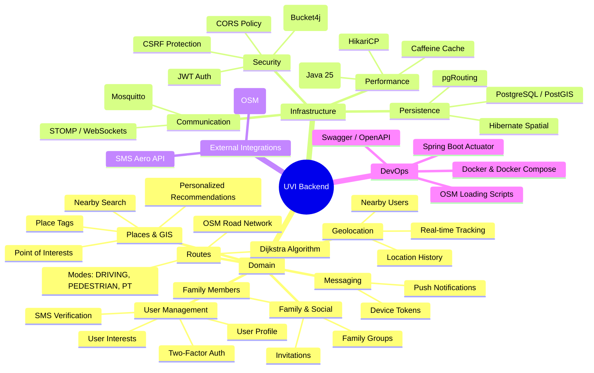

# UVI Project Mindmap

## Краткое описание архитектуры
- **Backend**: Spring Boot 4.0.3 + Java 25 (Loom).
- **GIS**: Использование PostGIS для сложных пространственных запросов и pgRouting для построения маршрутов по графу дорог Екатеринбурга.
- **Real-time**: Комбинация MQTT и WebSockets для мгновенной передачи геопозиции.
- **Security**: Многоуровневая защита (SMS -> 2FA -> JWT) с ограничением частоты запросов.
